# 设计模式

设计模式
   - 对软件设计中普遍存在（反复出现）的各种问题，所剔除的解决方案。每个设计模式系统命名、
解释和评价了面向对象系统中一个重要的和重复出现的设计。
     

面向对象的三大特性
   - 封装
   - 继承
   - 多态

接口：若干抽象方法的集合
   - 作用：限制实现接口的类必须按照接口给定的调用方式实现这些方法；对高层模块隐藏了类的内部实现。

### 面向对象设计原则（SOLID原则）
1. 开放封闭原则（开闭原则）
   - 一个软件实体如类、模块和函数应该对扩展开放，对修改关闭。即软件实体应尽量在
   不修改原有代码的情况下进行扩展。
     
2. 里式替换原则
   - 所有能饮用父类的地方必须能够透明的使用其子类对象
   
3. 依赖倒置原则
   - 高层模块不应该以来底层模块，二者应该依赖其抽象；
   - 抽象不应依赖细节，细节应该依赖抽象；换言之，要针对接口编程，而不是针对实现编程
   
4. 接口隔离原则
   - 使用多个专门的接口，而不适用单一的总接口，即客户端不应该依赖那些它不需要的借口
   
5. 单一职责
   - 不要存在多于一个导致类变更的原因。通俗的说，一个类只负责一项职责

### 一、创建型模式（5种）

    1-0. 简单工厂模式
    1-1. 工厂方法模式
    2. 抽象工厂模式
    3. 建造者模式
    4. 单例模式
    5. 原型模式（了解）  

### 二、结构型模式（7种）

    1. 适配器模式 
    2. 桥模式
    3. 组合模式
    4. 外观模式
    5. 代理模式  
    6. 装饰模式(了解)
    7. 享元模式(了解)

### 三、行为型模式（11种）

    1. 责任链模式
    2. 观察者模式（发布订阅）
    3. 策略模式
    4. 模板方法模式
    5. 解释器模式(了解)
    6. 命令模式（了解）
    7. 迭代器模式（了解）
    8. 中介者模式（了解）
    9. 备忘录模式（了解）
    10. 状态模式（了解）
    11. 访问者模式（了解）

___

## 创建型模式

#### 一 、 简单工厂模式

1 内容
   - 不直接向客户端暴露对象创建的实现细节，而是通过一个工厂类来负责产品类的实例

2 角色
   - 工厂角色（creater）
   - 抽象产品角色（product）
   - 具体产品角色（concrete product）

3 优点
   - 隐藏对象创建的细节；
   - 客户端不需要修改代码。

4 缺点
   - 违反了单一原则，将创建逻辑集中到一个工厂类中；
   - 当添加新产品时，需要修改工厂类代码，违反了开闭原则。

5 示例代码

```python
from abc import ABCMeta, abstractmethod


# 抽象产品
class Payment(metaclass=ABCMeta):
    @abstractmethod
    def pay(self, money):
        """"""


# 具体产品
class AliaPayment(Payment):
    def pay(self, money):
        print("支付宝支付：%s元" % money)


class WechatPay(Payment):
    def pay(self, money):
        print("微信支付:%s元")


# 工厂角色
class PaymentFactory(object):
    def creat_payment(self, method):
        if method == "alia":
            return AliaPayment()
        elif method == "wechat":
            return WechatPay()
        else:
            raise TypeError("No such payment name %s" % method)
# 客户端
```

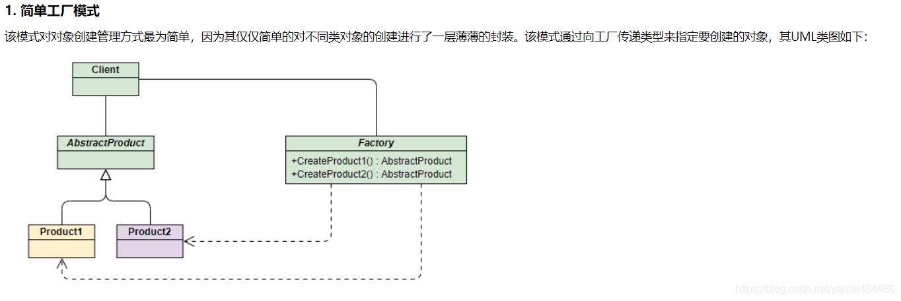


#### 二、工厂方法模式

1 角色
   - 抽象工厂角色；
   - 具体工厂角色；
   - 抽象产品角色
   - 具体产品角色
2. 角色
   - 抽象工厂
   - 具体工厂
   - 抽象产品
   - 具体产品
   
3. 优点
   - 更容易对现有功能进行扩展，如果有新的需求，只需要实现一个相应的工厂方法实现类即可，无需修改现有代码。
   - 不同工厂方法类，实现了单一职责的设计原则。
   
4. 缺点
   - 由于具体的对象由具体指定的工厂方法类创建，导致具体产品和工厂方法类之间具有较强的耦合性

5. 示例代码

```python
from abc import ABCMeta, abstractmethod


# 抽象产品（接口）
class Payment(metaclass=ABCMeta):
    @abstractmethod
    def pay(self, money):
        """"""


# 具体产品
class AliaPayment(Payment):
    def pay(self, money):
        print("支付宝支付%s元" % money)


class WechatPayment(Payment):
    def pay(self, money):
        print("微信支付%s元" % money)


class HuabaiPayment(Payment):
    def pay(self, money):
        print("花呗支付%s元" % money)


# 抽象工厂（接口）
class PaymentFactory(metaclass=ABCMeta):
    @abstractmethod
    def create_payment(self):
        """"""


# 具体工厂
class AliaFactory(PaymentFactory):
    def create_payment(self):
        return AliaPayment()


class WechatFactory(PaymentFactory):
    def create_payment(self):
        return WechatPayment()


class HuabaiFactory(PaymentFactory):
    def create_payment(self):
        return HuabaiPayment()


# 客户端
if __name__ == '__main__':
    a = HuabaiFactory().create_payment()
    a.pay(100)
```

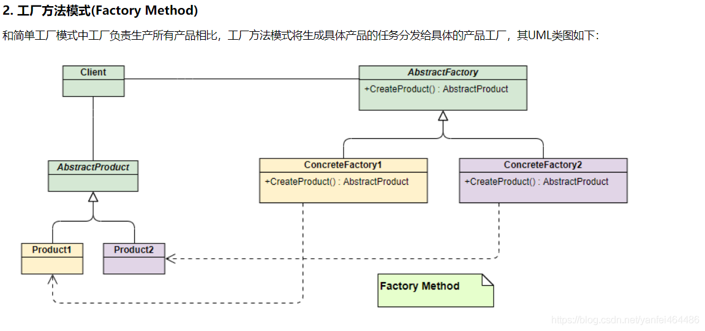


#### 三、 抽象工厂模式

1. 内容
    - 提供一个创建一系列相关或相互依赖对象的接口，而无须指定它们的具体类。

2. 角色
    - 抽象产品
    - 具体产品
    - 抽象工厂
    - 具体工厂

3. 优点
    - 将客户端与类的具体实现相分离
    - 每个工厂创建一个完整的产品锡类，是的易于交换产品系列
    - 有利于产品的一致性（即蟾皮之间的约束关系）

4. 缺点
    - 难以支持新种类（抽象）的产品

3. 示例代码

```python
from abc import ABCMeta, abstractmethod


# 抽象产品
class PhoneShell(metaclass=ABCMeta):
    @abstractmethod
    def show_shell(self):
        """"""


class CPU(metaclass=ABCMeta):
    @abstractmethod
    def show_cpu(self):
        """"""


class OS(metaclass=ABCMeta):
    @abstractmethod
    def show_os(self):
        """"""


# 抽象工厂接口
class PhoneFactory(metaclass=ABCMeta):
    @abstractmethod
    def make_shell(self):
        """"""

    @abstractmethod
    def make_cpu(self):
        """"""

    @abstractmethod
    def make_os(self):
        """"""


# 具体产品
class SmallShell(PhoneShell):
    def show_shell(self):
        print("小手机壳")


class BigShell(PhoneShell):
    def show_shell(self):
        print("大手机壳")


class AppleCPU(CPU):
    def show_cpu(self):
        print("苹果Cpu")


class MediaTekCPU(CPU):
    def show_cpu(self):
        print("联发科CPU")


class Android(OS):
    def show_os(self):
        print("安卓系统")


class Ios(OS):
    def show_os(self):
        print("ios系统")


# 具体工厂
class MiFactory(PhoneFactory):
    def make_shell(self):
        return BigShell()

    def make_cpu(self):
        return MediaTekCPU()

    def make_os(self):
        return Android()


class HuaWeiFactory(PhoneFactory):
    def make_shell(self):
        return SmallShell()

    def make_cpu(self):
        return MediaTekCPU()

    def make_os(self):
        return Android()


# 客户端
class Phone:
    def __init__(self, shell, cpu, os):
        self.shell = shell
        self.cpu = cpu
        self.os = os

    def show_info(self):
        self.shell.show_shell()
        self.cpu.show_cpu()
        self.os.show_os()


def make_phone(factory):
    shell = factory.make_shell()
    cpu = factory.make_cpu()
    os = factory.make_os()
    return Phone(shell, cpu, os)


factory = MiFactory()
phone = make_phone(factory)
phone.show_info()
```

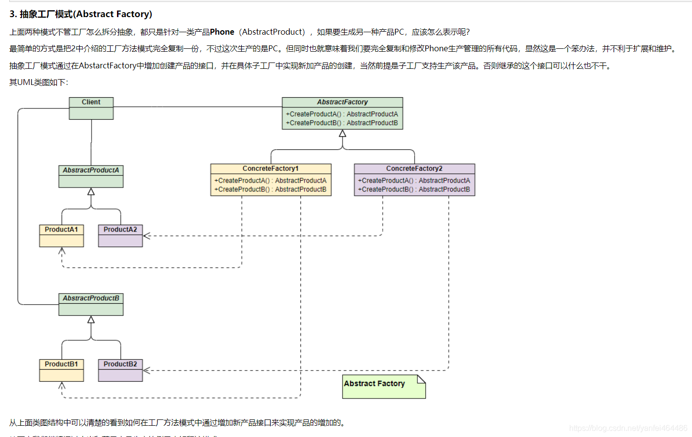
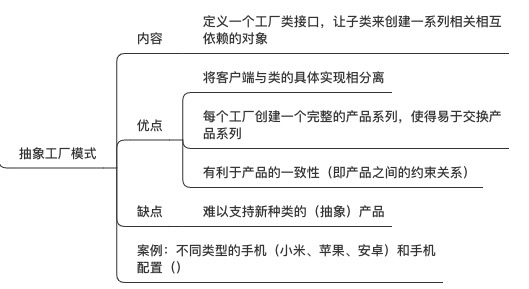

#### 四、 建造者模式

1. 内容
    - 主要用于构建一些复杂的对象，这些对象内部构造顺序通常是稳定的，但对象内部的构建往往则是复杂多变的。
2. 角色
    - 抽象建造者（builder）
    - 具体建造者（concrete builder）
    - 指挥者（director）
    - 产品

3. 优点：
    - 客户端不必知道产品内部细节，产品的产生和产品的构建过程解耦，相同的构建过程可以创建不同种类的对象；
    - 客户端想要修改产品类别，只需要修改具体的产品建造者；
    - 增加新的具体构造者无需修改现有代码，扩展方便，符合“开闭原则”。

4. 缺点：
    - 使用范围有限制：使用建造者模式中，产品组成成分和构造过程相似，产品之间差别太大则不适合建造者模式
    - 如果产品内部变化比较负责，需要很多具体建造者来适应这种变化，导致建造类继承关系臃肿。

5. 适用场景
    - 需要生成的产品对象有复杂的内部结构，这些产品对象通常包含多个成员属性。
    - 需要生成的产品对象的属性相互依赖，需要指定其生成顺序。
    - 隔离复杂对象的创建和使用，并使得相同的创建过程可以创建不同的产品。


6. 应用实例
    - 换装游戏中，给人物选择不同的帽子，上衣，裤子，鞋子，包包等

7. 示例代码

```python
from abc import ABCMeta, abstractmethod


class Player:
    def __init__(self, face=None, body=None, arm=None, leg=None):
        self.face = face
        self.body = body
        self.arm = arm
        self.leg = leg

    def __str__(self):
        return "%s,%s,%s,%s" % (self.face, self.body, self.arm, self.leg)


class PlayerBuilder(metaclass=ABCMeta):
    @abstractmethod
    def build_face(self):
        """"""

    @abstractmethod
    def build_body(self):
        """"""

    @abstractmethod
    def build_arm(self):
        """"""

    @abstractmethod
    def build_leg(self):
        """"""


class SexGrilBuilder(PlayerBuilder):
    def __init__(self):
        self.player = Player()

    def build_face(self):
        self.player.face = "4444"

    def build_body(self):
        self.player.body = "3333"

    def build_arm(self):
        self.player.arm = "2222"

    def build_leg(self):
        self.player.leg = "1111"


class Monster(PlayerBuilder):
    def __init__(self):
        self.player = Player()

    def build_face(self):
        self.player.face = "1111"

    def build_body(self):
        self.player.body = "111"

    def build_arm(self):
        self.player.arm = "222"

    def build_leg(self):
        self.player.leg = "3333"


class PlayerDirect:
    def build_player(self, builder):
        builder.build_body()
        builder.build_face()
        builder.build_arm()
        builder.build_leg()
        return builder.player


# 客户端
m = Monster()
p = PlayerDirect().build_player(m)
print(p)
```


#### 五、 单例模式

1. 内容
    - 保证一个类仅有一个实例，并提供一个访问它的全局访问点

2. 优点
    - 由于全局只有唯一实例，因此单例模式可以严格控制客户端的访问；
    - 由于系统内存中只存在一个对象，节省系统资源；对于频繁创建和销毁的对象，单例模式无疑可以提高系统性能。
    - 单例模式可以进一步进化为创建固定数目的实例（多例模式）。

3. 缺点
    - 单例模式没有抽象层，扩展很困难（享元模式=多例模式+抽象层）
    - 单例类的职责过”重“，既当工厂类（提供工厂方法）有充当产品角色（提供产品的功能方法）
    - 注意线程安全

4. 代码示例

```python
# 创建单例模式
class Singleton(object):
    def __new__(cls, *args, **kwargs):
        if not hasattr(cls, "_instance"):
            cls._instance = super(Singleton, cls).__new__()
        return cls._instance


class MyTest(Singleton):
    def __init__(self, a):
        self.a = a
```


***

## 结构型模型

#### 六、 适配器模式

1. 内容
    - 将一类的接口转换成客户希望的另外一个接口，Adapter模式使得原本由于接口不兼容而不能一起工作那些类可以一起工作。

2. 角色
    - 待适配接口
    - 目标接口
    - 适配器
        - 类适配器
        - 对象适配器
3. 优点
    - 为复用现有的类与方法，通过引入Adapter将适配者与目标接口兼容，而不需要修改原有代码；
    - 增加适配者类的透明性，适配者类被封装在适配器类中，对客户端而言是透明的。
    - 灵活性和拓展性好，可以在不改变原有代码基础上增加新的适配器类，符合开闭原则。

4. 缺点
    - 对于Java、C#等不支持多重继承的语言，一次最多只能适配一个适配者类

5. 适用场景
    - 系统需要使用现有的类，而这些类的接口不符合系统的需要。
    - 在系统设计之初，需要使用第三方组件的地方可以使用适配器模式（该组件与系统的接口是不同的，而系统没有必要为了迎合它而改动自己的接口）

6. 示例代码

```python
from abc import ABCMeta, abstractmethod


# 目标接口
class Payment(metaclass=ABCMeta):
    @abstractmethod
    def pay(self, money):
        """"""


class AliaPay(Payment):
    def pay(self, money):
        return "支付宝支付1000"


class WechatPay(Payment):
    def pay(self, money):
        return "微信支付1000元"


# 待适配类
class BankPay:
    def cost(self, money):
        print("银联支付1000元")


# 类适配器
class NewBankPay(Payment, BankPay):
    def pay(self, money):
        self.cost(money)


# 对象适配器
class Adapter(Payment):
    def __init__(self, payment):
        self.payment = payment

    def pay(self, money):
        self.payment.cost(money)


# 客户端
adapter = Adapter(BankPay())
res = adapter.pay(100)
print(res)
```

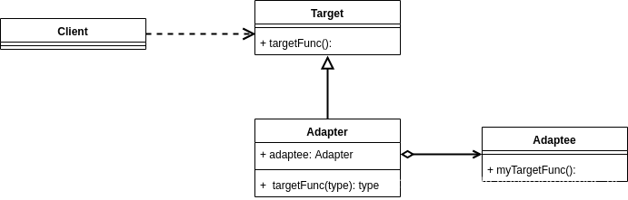
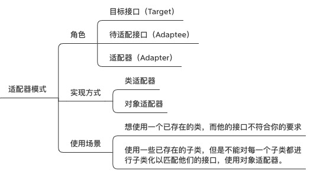

#### 七、 桥模式

1. 内容
    - 将抽象部分与它的实现部分相分离，使他们可以独立的变化。

2. 角色
    - 抽象类
    - 细化抽象类
    - 具体类
    - 细化具体类

3. 优点
    - 抽象和实现相分离，耦合度降低
    - 优秀的扩展能力

4. 使用场景
    - 当一个事物有两个维度上的表现，两个维度都可扩展时
    - 单文档窗口和多文档窗口，操作系统windows、mac

5. 代码示例

```python
from abc import ABCMeta, abstractmethod


# 抽象类
class Shape(metaclass=ABCMeta):
    def __init__(self, color):
        self.color = color

    @abstractmethod
    def draw(self):
        """"""


# 具体类
class Color(metaclass=ABCMeta):
    @abstractmethod
    def print(self, shape):
        """"""


# 具体实现类
class Red(Color):
    def print(self, shape):
        print("红色的%s" % shape.name)


# 具体实现类
class Blue(Color):
    def print(self, shape):
        print("蓝色的%s" % shape.name)


# 细化抽象类
class Line(Shape):
    name = "直线"

    def draw(self):
        return self.color.print(self)


# 细化抽象类
class Circle(Shape):
    name = "圆形"

    def draw(self):
        return self.color.print(self)


# 客户端
t = Line(Red())
t = Circle(Blue())
d = t.draw()
```

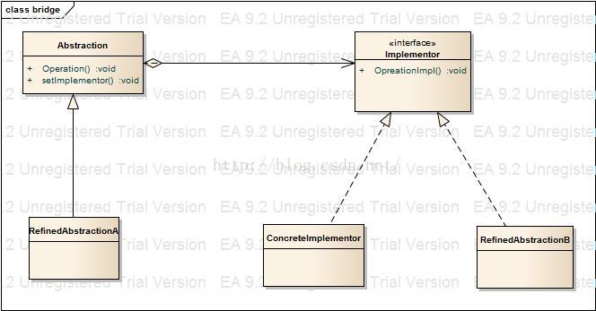
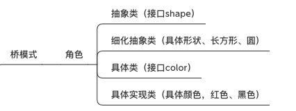

#### 八、 组合模式

1. 内容
    - 将对象组合成树形结构以表示部分整体的关系，Composite使得用户对单个对象和组合对象的使用具有一致性。

2. 角色
    - 抽象组件
    - 叶子组件
    - 复合组件

3. 优点
    - 定义了包含基本对象和组合对象的类层次结构；
    - 简化了客户端代码，即客户端可以一直的使用组合对象和单个对象；
    - 更容易增加新类型的组件。


4. 使用场景
    - 表示对象的“部分-整体”层次结构（特别是递归结构）
    - 希望用户忽略组合对象和单个对象的不同，用户统一使用组合结构中的所有对象

5. 代码示例

```python
from abc import ABCMeta, abstractmethod


class Graphic(metaclass=ABCMeta):
    def draw(self):
        pass


class Point(Graphic):
    def __init__(self, x, y):
        self.x = x
        self.y = y

    def __str__(self):
        return "点(%s，%s)" % (self.x, self.y)

    def draw(self):
        print(self)


class Line(Graphic):
    def __init__(self, point1, point2):
        self.point1 = point1
        self.point2 = point2

    def __str__(self):
        return "线段[%s，%s]" % (self.point1, self.point2)

    def draw(self):
        print(self)


class Picture(Graphic):
    def __init__(self, iterable=[]):
        self.children = []
        for item in iterable:
            self.children.append(item)

    def add(self, graphic):
        self.children.append(graphic)

    def draw(self):
        print("---复合图形---")
        for graphic in self.children:
            graphic.draw()
        print("---复合图形---")


# 客户端
point1 = Point(1, 2)
point2 = Point(2, 3)
print(point1)
line1 = Line(point1, point2)
line2 = Line(Point(3, 4), Point(5, 5))
print(line1)

p = Picture([line1, point2])
p.add(point2)
p.add(line2)
p.draw()

p2 = Picture()
p2.add(p)
p2.draw()
```

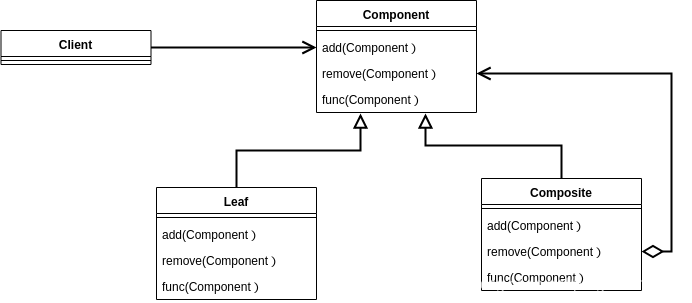
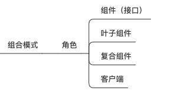

#### 九、 外观模式

1. 内容
    - 为子系统中的一组接口提供一个一致的界面，外观模式定义了一个高层接口，这个接口使得子系统更加容易使用。

2. 角色
    - 外观（facade）
    - 子系统类

3. 优点
    - 减少系统相互依赖
    - 提高灵活性
    - 提高了安全性

4. 缺点
   - 不规范的编程方式
   - 没有面向抽象编程，而是通过增加中介层，转换服务提供方的服务接口；

5. 应用场景
   - 简化子系统复杂性时。
   - 监控所有子系统时；通过门面控制了入口，可以统一监控；
   - 希望封装和隐藏子系统时；
   - 两历史系统进行改造并打通关系时；

6. 代码示例

```python
# 子系统
class CPU:
    def run(self):
        print("CPU启动")

    def stop(self):
        print(("CPU停止"))


class Disk:
    def run(self):
        print("硬盘启动")

    def stop(self):
        print(("硬盘停止"))


class Memory:
    def run(self):
        print("内存启动")

    def stop(self):
        print("内存停止工作")


# 外观（facade）
class Facade(object):
    def __init__(self):
        self.cpu = CPU()
        self.disk = Disk()
        self.memory = Memory()

    def run(self):
        self.cpu.run()
        self.disk.run()
        self.memory.run()

    def stop(self):
        self.cpu.stop()
        self.disk.stop()
        self.memory.stop()


# 客户端
window = Facade()
window.run()
window.stop()
```

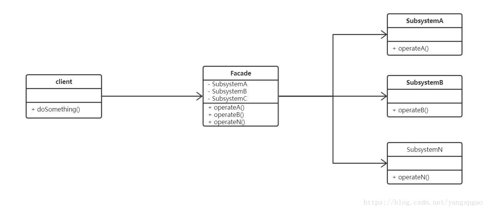

#### 十、 代理模式

1. 内容
    - 为其他对象提供一种代理以控制对这个对象的访问
2. 角色
    - 抽象实体（Subject）
    - 实体（RealSubject）
    - 代理（Proxy）

3. 优点
    - 远程代理：为远程的对象提供代理，可以隐藏位于远程地址空间的实事
    - 虚代理：根据需要创建很大的对象
    - 保护代理：空置对原始对象的访问，用户对象有不同的访问权限

4. 代码示例

```python
from abc import ABCMeta, abstractmethod


# 抽象实体
class Subject(metaclass=ABCMeta):
    @abstractmethod
    def get_content(self):
        """"""

    @abstractmethod
    def set_content(self, content):
        """"""


# 实体
class RealSubject(Subject):
    def __init__(self, filename):
        self.filename = filename
        with open(filename, "r") as f:
            self.content = f.read()

    def get_content(self):
        return self.content

    def set_content(self, content):
        with open(self.filename, "w") as f:
            f.write(content)


# 代理（虚代理）
class VirtualProxy(Subject):
    def __init__(self, filename):
        self.filename = filename
        self.subj = None

    def get_content(self):
        if not self.subj:
            self.subj = RealSubject(self.filename)
        return self.subj.get_content()

    def set_content(self, content):
        if not self.subj:
            self.subj = RealSubject(self.filename)
        self.subj.set_content(content)


# 代理（保护代理）
class ProtectedSubject(Subject):
    def __init__(self, filename):
        self.subj = RealSubject(filename)

    def get_content(self):
        return self.subj.get_content()

    def set_content(self, content):
        raise PermissionError("没有权限")
```

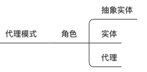


***

## 行为型模式

#### 十一、责任链模式

1. 内容
    - 使多个对象都有机会处理请求，从而避免请求的送发者和接收者之间的耦合关系

2. 角色
    - 抽象类（Handler）
    - 具体实现类（ConcreteHandler）

3. 优点
    - 降低耦合度：一个对象无需知道是其他哪个对象处理其请求

4. 使用场景
    - 有多个对象可以处理一个请求，哪个对象处理由运行时决定
    - 在不明确接受者的情况下，想多个对象中的一个提交一个请求
    - redis集群中主节点的实现，每个节点负责指点数量的指派曹

5. 代码示例

```python
from abc import ABCMeta, abstractmethod


# 抽象处理者（Handler）
class Handler(metaclass=ABCMeta):
    @abstractmethod
    def handle_leave(self, days):
        """"""


# 具体处理者（ConcreteHandler）
class GeneralManger(Handler):
    def handle_leave(self, days):
        if days < 20:
            print("准假")
        else:
            print("你还是离职吧")


class DepartmentManager(Handler):
    def __init__(self):
        self.next = GeneralManger()

    def handle_leave(self, days):
        if days < 10:
            print("准假")
        else:
            print("主管职权不足")
            self.next.handle_leave(days)


class ProjectManager(Handler):
    def __init__(self):
        self.next = DepartmentManager()

    def handle_leave(self, days):
        if days < 5:
            print("准假")
        else:
            print("项目经理职权不足")
            self.next.handle_leave(days)


# 客户端
day = 20
h = ProjectManager()
h.handle_leave(day)
```

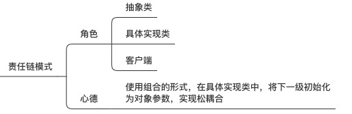

#### 十二、 观察者模式

1. 内容
    - 定义对象间一对多的依赖关系，当一个对象的状态发生改变时，所有依赖于它的对象都得到通知自动更新。

2. 角色
    - 抽象观察者
    - 具体观察者
    - 抽象主题
    - 具体主题

3. 优点
    - 目标和观察者之间的耦合最小
    - 支持广播通信

4. 使用场景
    - 当对一个对象的改变需要同事改变其他对象，而不知道有多少对象有待改变
    - 当一个对象必须通知其他对象，而它又不能确定其他对象是谁，换言之，不希望对象是紧密耦合的。

5. 代码示例

```python
from abc import ABCMeta, abstractmethod


# 抽象主题（Subject）
class Notice:
    def __init__(self):
        self.observer = []

    def attach(self, observer):
        self.observer.append(observer)

    def detach(self, observer):
        self.observer.remove(observer)

    def notify(self):
        for obs in self.observer:
            obs.update(self)


# 具体主题（ConcreteSubject）---发布者
class StaffNotice(Notice):
    def __init__(self, comp_info):
        super().__init__()
        self.__comp_info = comp_info

    # 负责读
    @property
    def comp_info(self):
        return self.__comp_info

    # 负责写
    @comp_info.setter
    def comp_info(self, info):
        self.__comp_info = info
        self.notify()


# 抽象观察者（Observer）
class Observer(metaclass=ABCMeta):
    @abstractmethod
    def update(self, notice):
        """"""


# 具体观察者（ConcreteObserver）---订阅者
class Staff(Observer):
    def __init__(self):
        self.comp_info = None

    def update(self, notice):
        self.comp_info = notice.comp_info


# 客户端
if __name__ == '__main__':
    notice = StaffNotice("初始化公司信息")
    s1 = Staff()
    s2 = Staff()
    notice.attach(s1)
    notice.attach(s2)
    notice.comp_info = "今年业绩不错"
    print(s1.comp_info)
    notice.detach(s2)
    notice.comp_info = "公司倒闭了"
    print(s1.comp_info)
```

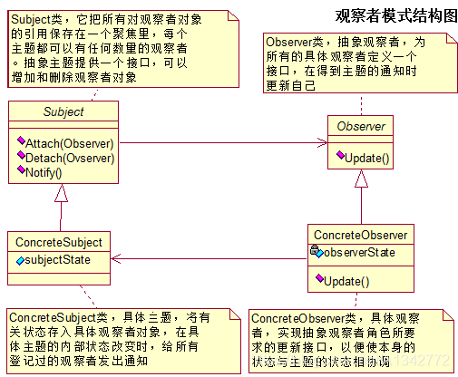
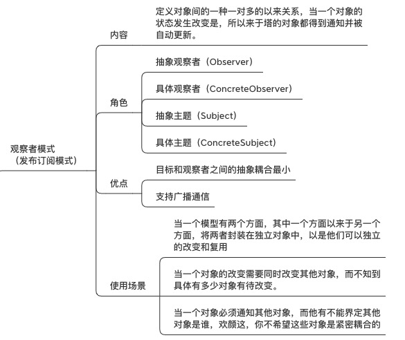

#### 十三、 策略模式

1. 内容
    - 定义一系列的算法，把他们一个个封装起来，并使他们可以互相替换，本模式使得算法可以独立于使用它们的客户。

2. 角色
    - 抽象策略
    - 具体策略
    - 上下文管理(策略切换)

3. 优点
    - 提供了相同行为的不同实现
    - 消除可一些条件语句
    - 定义了一系列可重用的算法或行为

4. 缺点
    - 高层代码人员了解不同策略的长处

5. 代码示例

```python
from abc import ABCMeta, abstractmethod


# 抽象策略（接口）
class Strategy(metaclass=ABCMeta):
    def execute(self, data):
        """"""


# 具体策略
class FastStrategy(Strategy):
    def execute(self, data):
        print("用较快的策略处理%s" % data)


class SlowStrategy(Strategy):
    def execute(self, data):
        print("用较慢的方式执行%s" % data)


# 上下文Context
class Context:
    def __init__(self, strategy, data):
        self.strategy = strategy
        self.data = data

    def set_strategy(self, strategy):
        self.strategy = strategy

    def do_strategy(self):
        self.strategy.execute(self.data)


# 客户端
data = "xxxxx"
strategy = FastStrategy()
c = Context(strategy, data)
c.do_strategy()

strategy = SlowStrategy()
c.set_strategy(strategy)
c.do_strategy()
```

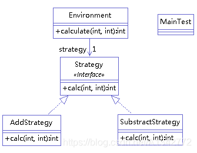
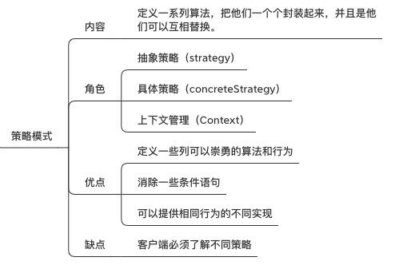

#### 十四、 模版方法模式

1. 内容
    - 定义一个操作中的算法的骨架，而将一些步骤延迟到子类中，TemplateMethod使得子类可以不改变一个算法的结构即可以重定义该算法得某些特定步骤。

2. 角色
    - 抽象类
    - 具体实现类

3. 使用场景
    - 一次性实现一个算法不变的部分
    - 各个子类中的公共行为应该被提取出来并集中到一个公共父类中以避免代码重复
    - 空置子类扩展

4. 代码示例

```python
from abc import ABCMeta, abstractmethod
import time


# 窗口（接口）
class Windows(metaclass=ABCMeta):
    @abstractmethod
    def start(self):
        """"""

    @abstractmethod
    def repaint(self):
        """"""

    @abstractmethod
    def close(self):
        """"""

    def run(self):
        self.start()
        while True:
            try:
                self.repaint()
                time.sleep(1)
            except KeyboardInterrupt:
                break
        self.close()


class MyWindow(Windows):
    def __init__(self, msg):
        self.msg = msg

    def start(self):
        print("开始")

    def repaint(self):
        print("窗口正在运行")

    def close(self):
        print("程序结束")


# 客户端
msg = "hello"
MyWindow(msg).run()
```

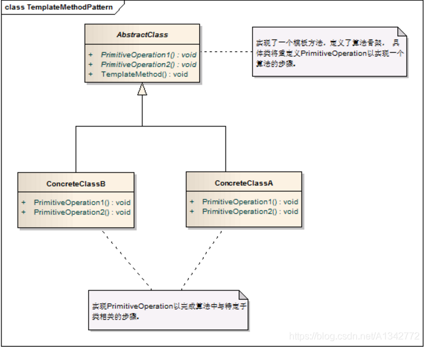
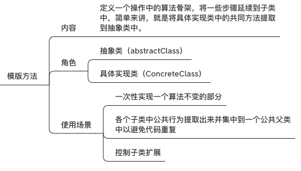