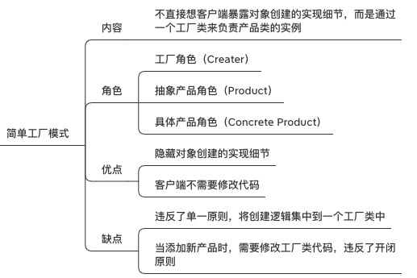
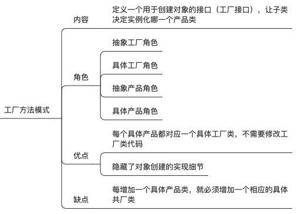
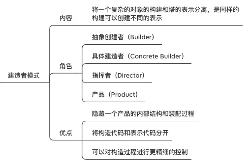
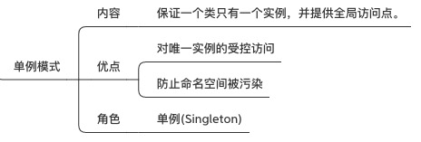

# 设计模式

### 一、创建型模式（5种）
    1. 简单工厂模式
    2. 工厂方法模式
    3. 抽象工厂模式
    4. 建造者模式
    5. 单例模式
    6. 原型模式（不常用）  


### 二、结构型模型（7种）
    1. 适配器模式 
    2. 桥模式
    3. 组合模式
    4. 外观模式
    5. 代理模式  
    6. 装饰模式
    7. 享元模式
    
### 三、行为型模型（11种）
    1. 责任链模式
    2. 观察者模式（发布订阅）
    3. 策略模式
    4. 模板方法模式
    5. 解释器模式
    6. 命令模式
    7. 迭代器模式
    8. 中介者模式
    9. 备忘录模式
    10. 状态模式
    11. 访问者模式
    
___

#### 一 、 简单工厂模式

> 1 内容
> > 不直接向客户端暴露对象创建的实现细节，而是通过一个工厂类来负责产品类的实例

> 2 角色
> > 工厂角色（creater）
> > 抽象产品角色（product）
> > 具体产品角色（concrete product）

> 3 优点
> > 隐藏对象创建的细节；
> > 客户端不需要修改代码。

> 4 缺点
> > 违反了单一原则，将创建逻辑集中到一个工厂类中；
> > 当添加新产品时，需要修改工厂类代码，违反了开闭原则。

> 5 示例代码
>```python
> from abc import ABCMeta, abstractmethod
> # 抽象产品
> class Payment(metaclass=ABCMeta):
>     @abstractmethod    
>     def pay(self,money):
>         """"""
>
> # 具体产品
> class AliaPayment(Payment):
>     def pay(self,money):
>         print("支付宝支付：%s元"%money)
>
> class WechatPay(Payment):
>     def pay(self, money):
>         print("微信支付:%s元")
>
> # 工厂角色
> class PaymentFactory(object):
>     def creat_payment(self, method):
>         if method == "alia":
>             return AliaPayment()
>         elif method == "wechat":
>             return WechatPay()
>         else:
>             raise TypeError("No such payment name %s" % method)
> # 客户端
> p = 
>
>```



#### 二、工厂方法模式

> 1 角色
> > 抽象工厂角色；具体工厂角色；抽象产品角色、具体产品角色

> 5 示例代码
> ```python
> from abc import ABCMeta, abstractmethod
> # 抽象产品接口
> class Payment(metaclass=ABCMeta):
>    @abstractmethod
>    def pay(self, money):
>        """"""
>
> # 具体产品1
> class AliPay(Payment):
>    def pay(self, money):
>        print("支付宝支付：%s元" % money)
>
> # 具体产品2
> class WechatPay(Payment):
>    def pay(self, money):
>        print("微信支付：%s元"%money)
>
> #抽象工厂（接口）
> class PayFactory(metaclass=ABCMeta):
>    @abstractmethod
>    def creat_payment(self):
>        """"""
>
> # 具体工厂1
> class AliFactory(PayFactory):
>   def creat_payment(self):
>        return AliPay()
>
> # 具体工厂2
> class WechatFactory(PayFactory):
>    def creat_payment(self):
>        return WechatPay()
> 
> # 客户端
> p = AliFactory()
> p.creat_payment()
> t.pay()
>```




#### 三、 抽象工厂模式


#### 四、 建造者模式


#### 五、 单例模式


#### 六、 适配器模式


#### 七、 桥模式


#### 八、 组合模式


#### 九、 外观模式
    1. 内容
       - 为子系统中的一组接口提供一个一致的界面，外观模式定义了一个高层接口，这个接口使得子系统更加容易使用。
    2. 角色
       - 外观（facade）
       - 子系统类
#### 十、 代理模式


#### 十一、责任链模式


#### 十二、 观察者模式


#### 十三、 策略模式


#### 十四、 模版方法模式